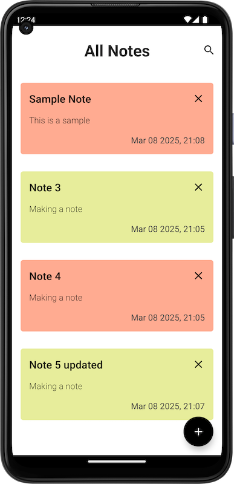
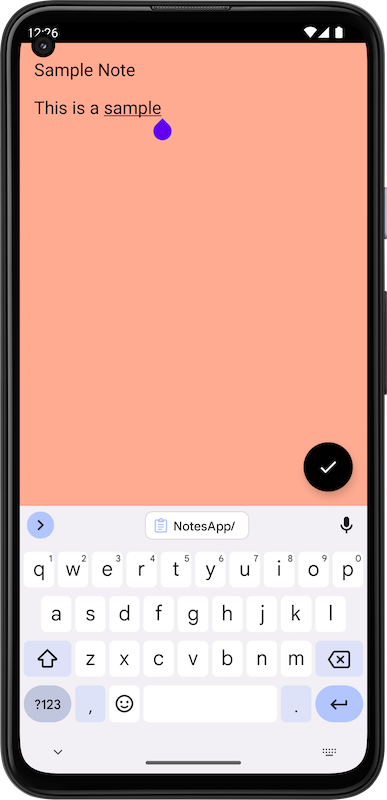
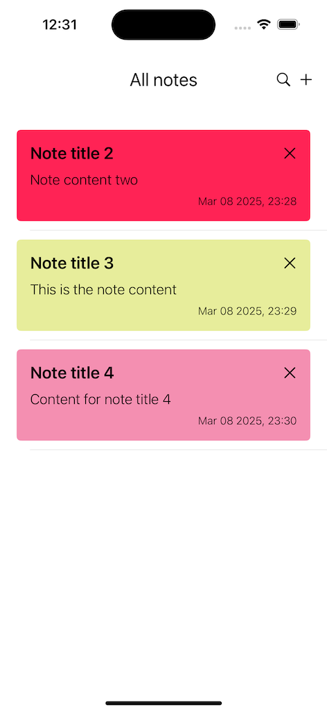
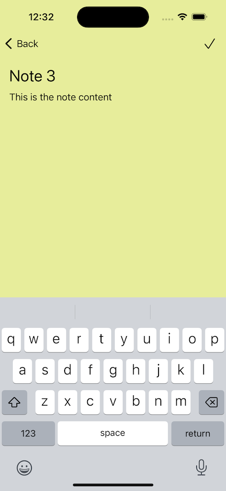

# Notes App (KMM)

## Overview
The **Notes App** is a cross-platform mobile application built using **Kotlin Multiplatform Mobile (KMM)**. It allows users to create, edit, and delete notes efficiently. The app supports both **Android** and **iOS**, sharing business logic across platforms while maintaining native UI.

## Features
- 📝 Create, edit, and delete notes
- 🔍 Search functionality for quick access
- 💾 Offline storage using **SQLDelight**

## Tech Stack
- **Kotlin Multiplatform Mobile (KMM)** – Code sharing between Android & iOS
- **Jetpack Compose** (Android UI)
- **SwiftUI** (iOS UI)
- **SQLDelight** – Local database for both platforms
- **Hilt** (Android) – Dependency injection

## Project Structure
```
NotesApp/
├── shared/                # KMM shared module
│   ├── src/commonMain/   # Shared business logic (ViewModels, Repository, etc.)
│   ├── src/androidMain/  # Android-specific implementations
│   ├── src/iosMain/      # iOS-specific implementations
├── androidApp/           # Android application module
├── iosApp/               # iOS application module
```

## 📸 Screenshots

### Android
Home Screen            |  Details Screen
:-------------------------:|:-------------------------:
![Android Home] | ![Android Details] 

### iOS
Home Screen            |  Details Screen
:-------------------------:|:-------------------------:
 | 


---

Made with ❤️ using KMM 🚀
